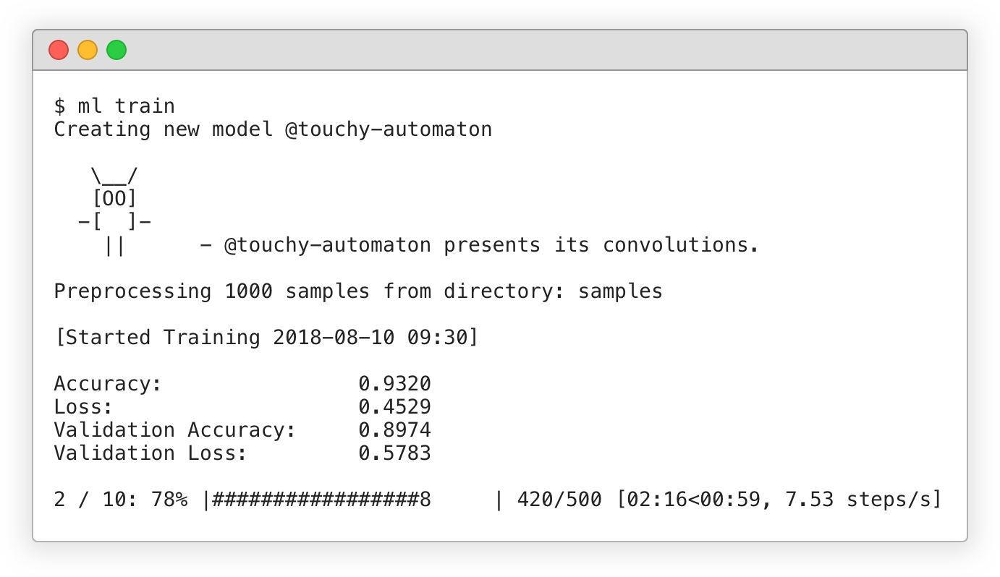

Introduction
============

VergeML is a **command line based environment** for exploring, training and running state-of-the-Art Machine Learning models. It integrates all necessary tools and services around creating your custom Machine Learning applications.

The leading principle of VergeML is "**easy without tradeoffs**". We aim at making Machine Learning accessible to everyone, while at the same time providing a complete toolkit for Machine Learning professionals. 

Features
============

VergeML is currently handling all tasks for running image based ML models and we are currently on our beta stage (VergeML_v0.1). It is under active development and maintenance! We operate on continuous integration, and all releases are tagged in git. If you'd like to contribute, see CONTRIBUTING! (link)

You will need Python 3.6 (and Cuda 9.1 & cuDNN 7.1 if you want GPU support)

### ML Projects ###

VergeML completely handles your ML projects by automatically creating all required directories and files as well as handling all relevant dependencies. 

### ML Models ###

We aim to port all state-of-the-art currently available ML Models to VergeML, making it as easy as typing 

    ml install "model_name" 

Currently we only support image based ML models (Model List) (Link). But keep posted, we are continuously working on including ALL ML models to work with VergeML!

If you'd like to contribute by porting new models, here (link) are detailed instructions on how to do it. 

### Data Management ###

VergeML handles all data specific workflows, from data loading to preprocessing and augmentations. Here (link) you can find more specific documentation on this chapter.

### Training and Performance ###
Train your models, manage your hyperparameters through the command line or via a config file and compare performances on your experiments. 

### Plug-In System ###

A text bla bla bla  

### REST Interface ###

Another text bla bla bla

Get Started
============

Getting started is easy, just follow this guide (link) and you will be up and running in no time! 

To install type: 

    pip install vergeml

Be shure to have Python 3.6 installed.

Documentation
============

Check out the docs:

* [Data Management](http://www.vergeml.com/model/inception_tl)
* [Installation](http://www.vergeml.com/model/inception_tl)
* [Models](http://www.vergeml.com/model/inception_tl)
* [Training](http://www.vergeml.com/model/inception_tl)
* [VergeML](http://www.vergeml.com/model/inception_tl)

Stay in touch
============
* [Twitter](https://twitter.com/VergeMl)
* [Blog](https://medium.com/@VergeML)

License
============
[MIT](/LICENSE.md) 

Copyright (c) 2018-present, Markus Ecker & Camillo Pachmann
