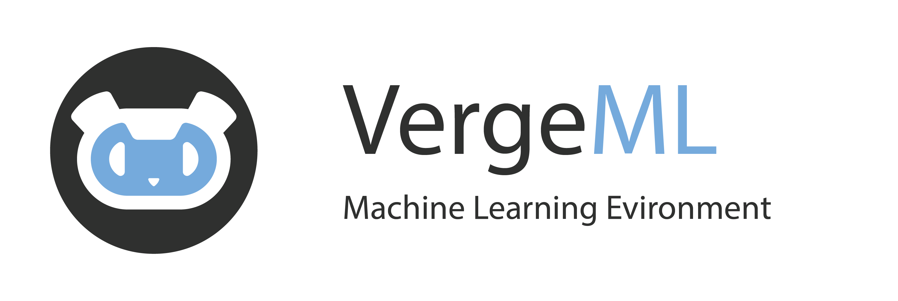

VergeML is a **command line based environment** for exploring, training and running state-of-the-art Machine Learning models. It provides [ready-to-use models](), handles [data preprocessing and augmentation](), tracks your AI's [training sessions]() and provides other goodies such as an [automatic REST interface]() and [exporting]() to the web and mobile platforms.

Also, you get a free ASCII robot with each training!

Here's how it looks in action:

Installation
============

VergeML runs on Windows, Linux and MacOS. You need to have Python 3.6 installed (and Cuda 9.1 & cuDNN 7.1 if you want GPU support).

To install VergeML us pip: 

    pip install vergeml

Verify your installation by typing:

    ml help

You should be greeted by a help message describing all things that can be done with VergeML.

Congratulations, you have successfully installed VergeML!

Quick Start
===========

Follow [this link]() for a quick start guide which will lead you through the process of training and running a custom AI in VergeML. 

Documentation
=============

1. [Installation](Installation/Installation.md)
2. [Get Started](Get_Started/Get_Started.md)
3. Models
    * [Model list](/Models/Models.md)
    * [Porting a new model to VergeML](/Models/Porting_a_model.md)
4. [Training overview](/Trainging/Get_Started.md)
    * [General training](/Training/General_training.md)
    * [Configuration file](/Training/Configuration_file.md)
    * [Preprocessinge pipeline](/Training/Preprocessing.md)
    * [Training sessions](/Training/Resource_management.md)
    * [Resource Management](/Training/Resource_management.md)
5. [Data management overview](/Data/Data_overview.md)
    * [Data loading](/Data/Data_loading.md)
    * [Data caching](/Data/Caching.md)
    * Data transformations (currently only image support)
        * [Image transformations] (/Data/Caching.md)
6. [REST interface](/Rest/Rest.md)
7. Plug-in system
    * [Tensorboard](/Plugin/Tensorboard.md)
    * [Jupyter Notebook](/Plugin/Jupyter.md)
8. Contribution
    * [Contributing](/Contribution/Contributing.md)
    * [Code of conduct](/Contribution/Code_of_conduct.md)

Contributing
=============

VergeML is under active development and maintenance. If you'd like to contribute, see [CONTRIBUTING](Documentation/Contribution/Contributing.md).

Stay in touch
============
* [Twitter](https://twitter.com/VergeMl)
* [Mdeium](https://medium.com/@VergeML)

License
============
[MIT](/LICENSE.md) 

Copyright (c) 2018-present, Markus Ecker & Camillo Pachmann 
